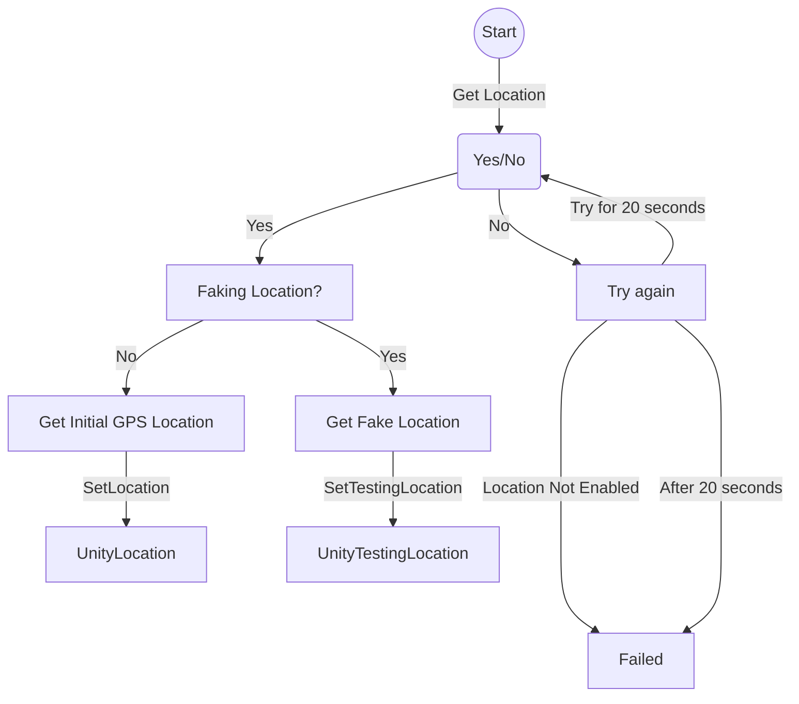
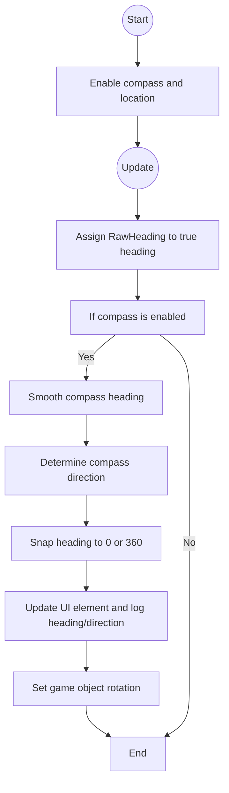

# Team-1-Repository

Het doel van dit project is het creëren van meerdere Augmented Reality (AR) games voor Android-gebruikers. Het spel moet gebruikmaken van de AR-functionaliteit op mobiele apparaten, moet worden ontwikkeld in Unity & maakt gebruik van GPS voor User Location. Kinderen voltooien hierin uitdagingen op verschillende locaties tijdens een wandeling om cijfers te verdienen voor een cijferslot. De uitdagingen worden weergegeven op een kaart met pictogrammen en de behaalde cijfers worden zichtbaar op het scherm. Om het slot te openen zijn minstens twee verschillende uitdagingen vereist. Herhaling van uitdagingen is mogelijk om alle cijfers te verkrijgen.
<br>  
Een complete en uitgebreide beschrijving is [hier](https://github.com/Bjornraaf/Team-1-Repository/wiki) te vinden.

# Geproduceerde Game Onderdelen

Geef per teammember aan welke game onderdelen je hebt geproduceerd. Doe dit met behulp van omschrijvingen visual sheets en screenshots.
Maak ook een overzicht van alle onderdelen met een link naar de map waarin deze terug te vinden zijn.

Bjorn Ravensbergen:
  * [GPS System](https://github.com/Bjornraaf/Team-1-Repository/tree/develop/Assets/Scripts/GPSSystem)

Patryk Podworny:
  * [Compass](https://github.com/Bjornraaf/Team-1-Repository/blob/develop/Assets/Scripts/GPSSystem/CompassController.cs)
  * [Worm Game](https://github.com/Bjornraaf/Team-1-Repository/tree/develop/Assets/Scripts/WormGame) & [UI](https://github.com/Bjornraaf/Team-1-Repository/tree/develop/Assets/Scripts/UI)

Ties Postma:
  * blank
  * blank

## GPS System


GPS System wordt gebruikt om de locatie van een speler te bepalen en weer te geven in Unity. Het script bevat variabelen zoals ```RealInit```, ```RealCurrentPosition``` en ```FakeCurrentPosition``` om de locatie van de speler op te slaan. Ook zijn er failsafes en methoden zoals ```UpdatePosition()``` en ```SetLocation()``` om de locatiegegevens bij te werken en te bepalen. Er zijn ook variabelen om het testen van de app te ondersteunen en te rapporteren over de locatiegegevens.

## Compass


De compass wordt gebruikt om de rotatie van een speler te bepalen zodat het UI element weergeeft welke kant de speler op kijkt in Unity. Het script bevat variabelen zoals.
GPS System wordt gebruikt om de locatie van een speler te bepalen en weer te geven in Unity. Het script bevat variabelen zoals ```RealInit```, ```RealCurrentPosition``` en ```FakeCurrentPosition``` om de locatie van de speler op te slaan. Ook zijn er failsafes en methoden zoals ```UpdatePosition()``` en ```SetLocation()``` om de locatiegegevens bij te werken en te bepalen. Er zijn ook variabelen om het testen van de app te ondersteunen en te rapporteren over de locatiegegevens.
